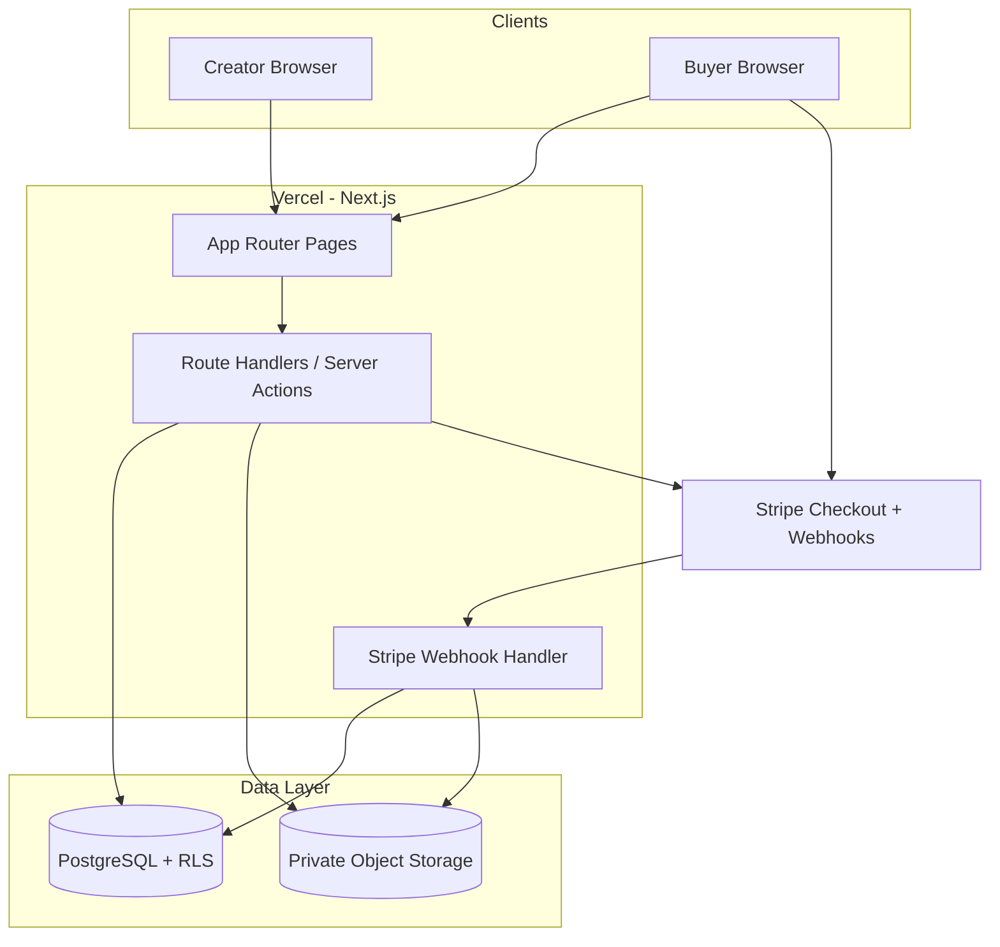

# Digital Product Store — Technical Architecture & Implementation Plan

Based on [MINI-BLUEPRINT.md](./MINI-BLUEPRINT.md): a **5-day, multi-tenant prototype** where creators sell digital products via Stripe, with **Postgres RLS** as a hard requirement.

---

## 1. Requirement Analysis

### 1.1 Functional Requirements

| # | Feature | Description |
|---|---------|-------------|
| F1 | **Creator registration** | Email/password signup; auto-create tenant `account` |
| F2 | **Multi-tenancy** | Every tenant table has `account_id`; isolation via **Postgres RLS** |
| F3 | **Session management** | Cookie-based or JWT sessions |
| F4 | **Product CRUD** | Name, description, price (minor units), currency, draft/published, file + thumbnail |
| F5 | **Orders dashboard** | Buyer email, product, amount, date, payment status |
| F6 | **Store settings** | Store name + URL slug (`/store/{slug}`) |
| F7 | **Public storefront** | Published products, product detail, Buy Now |
| F8 | **Stripe Checkout** | Hosted checkout; buyer email + card on Stripe |
| F9 | **Webhook processing** | `checkout.session.completed` → create order; **idempotent** |
| F10 | **Secure file delivery** | Signed, time-limited links; 24h **or** 3 downloads; no public asset URLs |

### 1.2 Non-Functional Requirements

| Category | Requirement |
|----------|-------------|
| **Security** | RLS at DB layer; no public purchase file URLs; signed downloads; input validation |
| **Data integrity** | Prices as **integer minor units** only; no floats |
| **Reliability** | Idempotent webhook handling (duplicate events → one order) |
| **Maintainability** | Clean separation of concerns; migrations; normalized schema |
| **Deployability** | Live URL + GitHub repo; Stripe test mode |
| **Timeline** | 5 working days; daily 3-line updates |

### 1.3 Explicitly Out of Scope (per blueprint)

- Email notifications, subscriptions, analytics
- Pixel-perfect UI, mobile responsiveness, caching/performance tuning
- Buyer accounts (email-only at checkout)

### 1.4 Assumptions & Clarifications

| Item | Assumption | Clarification if needed |
|------|------------|-------------------------|
| Store URL | `/store/{slug}` (blueprint line 37 vs 41) | Treat **`/store/{slug}`** as canonical |
| Single creator per account | One `user` ↔ one `account` at signup | Multi-user teams not required |
| Currency | Single currency per product; USD default | Multi-currency display not required |
| Buyer identity | Stripe Checkout email only | No buyer login |
| File types | PDF, templates, ebooks (generic binary) | Max file size TBD (recommend 50–100 MB) |
| Draft products | Hidden from storefront | Visible only in dashboard |
| Slug uniqueness | Global across all tenants | Enforced via unique index |
| Auth provider | Custom email/password acceptable | No OAuth required |

---

## 2. Technology Stack

### Recommended Stack

| Layer | Choice | Why |
|-------|--------|-----|
| **Full-stack framework** | **Next.js 14+ (App Router)** | Single repo for UI + API routes + server actions; fast to ship in 5 days; SSR for public storefront; Route Handlers for Stripe webhooks |
| **Language** | **TypeScript** | Type-safe schema, Stripe SDK, fewer payment bugs |
| **Styling** | **Tailwind CSS** | Blueprint suggestion; rapid UI without design system overhead |
| **Database** | **PostgreSQL (Supabase or Neon)** | **RLS is mandatory**; Postgres is the only practical choice |
| **ORM** | **Drizzle ORM** | SQL-first migrations; easy to embed raw RLS policies; lighter than Prisma for small schema |
| **Auth** | **Lucia Auth** or **NextAuth (Credentials)** + Postgres sessions | Email/password without vendor lock-in; session → RLS via `SET LOCAL` |
| **File storage** | **Supabase Storage** or **Cloudflare R2** | Private buckets; signed URLs for downloads |
| **Payments** | **Stripe Checkout + Webhooks** | Required; hosted checkout minimizes PCI scope |
| **Deployment** | **Vercel** (app) + **Supabase/Neon** (DB) | Blueprint suggestion; zero-config deploy |

### Why Next.js (not separate React + Express)

- **5-day constraint**: one codebase, shared types, no CORS/auth duplication
- Webhook endpoint + dashboard + storefront in one deploy
- Server Components keep secrets off the client

### Alternatives Considered

| Alternative | Why not primary |
|-------------|-----------------|
| **Remix** | Equally valid; less blueprint alignment |
| **Separate React SPA + FastAPI/Nest** | More boilerplate for 5 days |
| **Supabase Auth + client** | Faster auth, but RLS tied to `auth.uid()` — works if `users.id` matches Supabase auth |
| **Prisma** | Fine, but RLS/migration control slightly heavier |
| **Firebase** | No native Postgres RLS |

### Recommended variant: Supabase-all-in-one

If speed is paramount:

- Postgres + RLS + Auth + Storage in one project
- RLS policies use `auth.uid()` joined to `users.account_id`
- Trade-off: slightly more Supabase-specific code

---

## 3. Database Architecture

### 3.1 Why PostgreSQL

- **RLS is a first-class requirement** — not app-only filtering
- ACID for orders + idempotent webhooks
- `BIGINT` for minor units avoids float errors
- Strong indexing, constraints, and migrations (Drizzle SQL migrations)

### 3.2 Entity-Relationship Overview

```mermaid
erDiagram
    accounts ||--o{ users : has
    accounts ||--o{ products : owns
    accounts ||--o{ orders : receives
    products ||--o{ orders : "sold via"
    orders ||--o| download_tokens : grants

    accounts {
        uuid id PK
        string name
        string slug UK
        timestamp created_at
    }

    users {
        uuid id PK
        uuid account_id FK
        string email UK
        string password_hash
        timestamp created_at
    }

    products {
        uuid id PK
        uuid account_id FK
        string name
        text description
        int price_minor
        string currency
        enum status
        string file_key
        string thumbnail_key
        timestamp created_at
    }

    orders {
        uuid id PK
        uuid account_id FK
        uuid product_id FK
        string buyer_email
        int amount_minor
        string currency
        enum payment_status
        string stripe_session_id UK
        string stripe_payment_intent_id
        timestamp created_at
    }

    download_tokens {
        uuid id PK
        uuid order_id FK UK
        string token_hash UK
        int download_count
        int max_downloads
        timestamp expires_at
        timestamp created_at
    }
```

### 3.3 Table Definitions

#### `accounts` (tenant)

```sql
CREATE TABLE accounts (
  id         UUID PRIMARY KEY DEFAULT gen_random_uuid(),
  name       TEXT NOT NULL DEFAULT 'My Store',
  slug       TEXT NOT NULL UNIQUE,
  created_at TIMESTAMPTZ NOT NULL DEFAULT now(),
  updated_at TIMESTAMPTZ NOT NULL DEFAULT now()
);

CREATE UNIQUE INDEX idx_accounts_slug ON accounts (slug);
```

#### `users`

```sql
CREATE TABLE users (
  id            UUID PRIMARY KEY DEFAULT gen_random_uuid(),
  account_id    UUID NOT NULL REFERENCES accounts(id) ON DELETE CASCADE,
  email         TEXT NOT NULL UNIQUE,
  password_hash TEXT NOT NULL,
  created_at    TIMESTAMPTZ NOT NULL DEFAULT now()
);

CREATE INDEX idx_users_account_id ON users (account_id);
```

#### `products`

```sql
CREATE TYPE product_status AS ENUM ('draft', 'published');

CREATE TABLE products (
  id             UUID PRIMARY KEY DEFAULT gen_random_uuid(),
  account_id     UUID NOT NULL REFERENCES accounts(id) ON DELETE CASCADE,
  name           TEXT NOT NULL,
  description    TEXT,
  price_minor    INTEGER NOT NULL CHECK (price_minor >= 0),
  currency       CHAR(3) NOT NULL DEFAULT 'USD',
  status         product_status NOT NULL DEFAULT 'draft',
  file_key       TEXT NOT NULL,
  file_name      TEXT NOT NULL,
  file_size      BIGINT,
  thumbnail_key  TEXT,
  created_at     TIMESTAMPTZ NOT NULL DEFAULT now(),
  updated_at     TIMESTAMPTZ NOT NULL DEFAULT now()
);

CREATE INDEX idx_products_account_id ON products (account_id);
CREATE INDEX idx_products_account_status ON products (account_id, status);
```

#### `orders`

```sql
CREATE TYPE payment_status AS ENUM ('pending', 'paid', 'failed', 'refunded');

CREATE TABLE orders (
  id                         UUID PRIMARY KEY DEFAULT gen_random_uuid(),
  account_id                 UUID NOT NULL REFERENCES accounts(id) ON DELETE CASCADE,
  product_id                 UUID NOT NULL REFERENCES products(id),
  buyer_email                TEXT NOT NULL,
  amount_minor               INTEGER NOT NULL,
  currency                   CHAR(3) NOT NULL,
  payment_status             payment_status NOT NULL DEFAULT 'pending',
  stripe_checkout_session_id TEXT NOT NULL UNIQUE,
  stripe_payment_intent_id   TEXT,
  created_at                 TIMESTAMPTZ NOT NULL DEFAULT now()
);

CREATE INDEX idx_orders_account_id ON orders (account_id);
CREATE INDEX idx_orders_account_created ON orders (account_id, created_at DESC);
CREATE INDEX idx_orders_buyer_email ON orders (buyer_email);
```

#### `download_tokens`

```sql
CREATE TABLE download_tokens (
  id              UUID PRIMARY KEY DEFAULT gen_random_uuid(),
  order_id        UUID NOT NULL UNIQUE REFERENCES orders(id) ON DELETE CASCADE,
  token_hash      TEXT NOT NULL UNIQUE,
  download_count  INTEGER NOT NULL DEFAULT 0,
  max_downloads   INTEGER NOT NULL DEFAULT 3,
  expires_at      TIMESTAMPTZ NOT NULL,
  created_at      TIMESTAMPTZ NOT NULL DEFAULT now()
);

CREATE INDEX idx_download_tokens_token_hash ON download_tokens (token_hash);
CREATE INDEX idx_download_tokens_expires_at ON download_tokens (expires_at);
```

#### `webhook_events` (idempotency audit)

```sql
CREATE TABLE webhook_events (
  id              UUID PRIMARY KEY DEFAULT gen_random_uuid(),
  stripe_event_id TEXT NOT NULL UNIQUE,
  event_type      TEXT NOT NULL,
  processed_at    TIMESTAMPTZ NOT NULL DEFAULT now()
);
```

### 3.4 Row-Level Security Policies

**Pattern:** Set session variable on each authenticated DB request:

```sql
-- Application sets: SET LOCAL app.current_account_id = '<uuid>';
CREATE POLICY products_tenant_isolation ON products
  USING (account_id = current_setting('app.current_account_id')::uuid);
```

Policies needed on: `products`, `orders`, `download_tokens` (via join), optionally `accounts` (own row only).

**Service role connection** (webhooks, public storefront reads): bypass RLS or use dedicated policies:

```sql
-- Public read published products by slug (no auth)
CREATE POLICY products_public_read ON products
  FOR SELECT
  USING (
    status = 'published'
    AND account_id IN (SELECT id FROM accounts WHERE slug = current_setting('app.store_slug'))
  );
```

Webhook handler uses a **privileged DB role** with RLS bypass or explicit insert policies for `orders` + `download_tokens`.

### 3.5 Scalability Notes (future)

- Partition `orders` by `created_at` if volume grows
- Read replicas for storefront; primary for writes
- `account_id` on every tenant table enables shard-by-tenant later
- For this prototype: single Postgres instance is sufficient

---

## 4. Third-Party Services & APIs

| Service | Required? | Provider | Functionality | Est. Cost | Alternatives |
|---------|-----------|----------|---------------|-----------|--------------|
| **Payments** | **Yes** | **Stripe** (test mode) | Checkout Sessions, webhooks | Free in test; ~2.9% + $0.30 live | Paddle, Lemon Squeezy |
| **Auth** | Built-in | Self-hosted (Lucia/NextAuth) or Supabase Auth | Email/password, sessions | $0 | Clerk |
| **File storage** | **Yes** | **Supabase Storage** or **Cloudflare R2** | Private product files + thumbnails | Free tier sufficient | AWS S3, local FS (dev only) |
| **Database hosting** | **Yes** | **Supabase** or **Neon** | Postgres + RLS | Free tier | Railway Postgres |
| **Hosting** | **Yes** | **Vercel** | Next.js deploy, HTTPS | Free hobby tier | Railway, Fly.io |
| **Email/SMS** | No | — | — | — | Out of scope |
| **Maps** | No | — | — | — | — |
| **Push notifications** | No | — | — | — | — |
| **Analytics** | No | — | — | — | — |
| **AI** | No | — | — | — | — |
| **Monitoring** | Optional | **Sentry** (free tier) | Error tracking | $0 prototype | Vercel logs only |
| **Domain/SSL** | Yes | Vercel | Auto SSL on `*.vercel.app` | $0 | Custom domain optional |

### Stripe specifics

- **Checkout Session** with `metadata`: `product_id`, `account_id`, `buyer_email`
- **Webhook**: `checkout.session.completed` with signature verification
- **Idempotency**: unique constraint on `stripe_checkout_session_id` + `webhook_events.stripe_event_id`

---

## 5. System Architecture

### 5.1 High-Level Architecture



### 5.2 Request Flows

#### Creator login → dashboard

1. POST `/api/auth/login` → verify password → create HTTP-only session cookie
2. Middleware resolves `user → account_id`
3. DB connection sets `app.current_account_id` before queries
4. RLS ensures only tenant data returned

#### Public storefront

1. GET `/store/[slug]` → lookup `accounts` by slug (public query)
2. Fetch `products WHERE status = 'published'` for that account
3. No auth required; RLS policy or service query scoped by slug

#### Purchase flow

1. Buyer clicks **Buy Now** → POST `/api/checkout` with `productId`
2. Server validates product is published; creates Stripe Checkout Session
3. Redirect to Stripe hosted page
4. Stripe webhook → verify signature → idempotent order creation → generate download token
5. Redirect to `/thank-you?session_id=...` → page fetches order + signed download URL

#### Download flow

1. GET `/api/download/[token]`
2. Hash token → lookup `download_tokens`
3. Validate: not expired, `download_count < max_downloads`, order is `paid`
4. Increment count atomically (`UPDATE ... WHERE download_count < max_downloads`)
5. Generate short-lived signed URL from storage (or stream through API)

### 5.3 Where Business Logic Lives

| Logic | Location |
|-------|----------|
| Auth, session | `lib/auth/` + middleware |
| RLS context | `lib/db/` connection wrapper |
| Product CRUD | Server Actions in `app/dashboard/products/` |
| Checkout creation | `lib/stripe/create-checkout.ts` |
| Webhook processing | `app/api/webhooks/stripe/route.ts` |
| Download authorization | `lib/downloads/validate-token.ts` |
| Validation (Zod) | `lib/validators/` shared by actions + API |

**Rule:** No business logic in React components; UI calls server actions or API routes only.

### 5.4 API Surface (minimum)

| Method | Endpoint | Auth | Purpose |
|--------|----------|------|---------|
| POST | `/api/auth/signup` | Public | Register + create account |
| POST | `/api/auth/login` | Public | Session |
| POST | `/api/auth/logout` | Session | Logout |
| * | `/api/products/*` | Creator | CRUD (or Server Actions) |
| PATCH | `/api/settings` | Creator | Store name/slug |
| GET | `/api/store/[slug]` | Public | Store + products |
| POST | `/api/checkout` | Public | Create Stripe session |
| POST | `/api/webhooks/stripe` | Stripe sig | Process events |
| GET | `/api/download/[token]` | Token | Secure download |

---

## 6. Feature-by-Feature Technical Plan

### 6.1 Auth & Tenancy

**User flow:** Signup → account auto-created → login → dashboard.

| Layer | Implementation |
|-------|----------------|
| **Frontend** | `/signup`, `/login` forms; Zod validation; error states |
| **Backend** | Transaction: insert `accounts` (generate slug from email/name) + `users`; bcrypt hash |
| **Database** | FK `users.account_id`; RLS on all tenant tables |
| **Third-party** | None |
| **Validations** | Unique email; password ≥ 8 chars; slug `[a-z0-9-]` unique |
| **Dependencies** | DB migrations, auth library |

### 6.2 Creator Dashboard — Products

**User flow:** List products → create/edit → upload file + thumbnail → publish.

| Layer | Implementation |
|-------|----------------|
| **Frontend** | `/dashboard/products`, `/dashboard/products/new`, `/dashboard/products/[id]/edit` |
| **Backend** | Server Actions: create/update/delete; multipart upload → private storage |
| **Database** | `products` with `price_minor`, `status`, `file_key`, `thumbnail_key` |
| **Third-party** | Supabase Storage / R2 presigned upload |
| **Validations** | Price integer ≥ 0; published requires file; name required |
| **Dependencies** | Auth middleware, storage bucket |

### 6.3 Creator Dashboard — Orders

**User flow:** View paginated list of purchases.

| Layer | Implementation |
|-------|----------------|
| **Frontend** | `/dashboard/orders` table component |
| **Backend** | Server Action: `getOrders(accountId)` with RLS |
| **Database** | Join `orders` + `products`; index on `(account_id, created_at)` |
| **Third-party** | None |
| **Validations** | RLS-only access |
| **Dependencies** | Webhook creating orders |

### 6.4 Creator Dashboard — Settings

**User flow:** Update store name and slug.

| Layer | Implementation |
|-------|----------------|
| **Frontend** | `/dashboard/settings` form with slug preview |
| **Backend** | Update `accounts`; validate slug uniqueness |
| **Database** | Unique index on `slug` |
| **Validations** | Slug format; reserved words (`admin`, `api`, `store`) blocked |
| **Dependencies** | Auth |

### 6.5 Public Storefront

**User flow:** Visit `/store/maya` → browse → product detail → Buy Now.

| Layer | Implementation |
|-------|----------------|
| **Frontend** | `/store/[slug]`, `/store/[slug]/products/[id]` |
| **Backend** | Public queries scoped by slug; only `published` products |
| **Database** | Query via `accounts.slug` join |
| **Validations** | 404 for unknown slug; draft products invisible |
| **Dependencies** | Products exist |

### 6.6 Checkout & Payments

**User flow:** Buy Now → Stripe → thank-you page.

| Layer | Implementation |
|-------|----------------|
| **Frontend** | Buy Now button; `/thank-you` with download CTA |
| **Backend** | Create Checkout Session; webhook handler |
| **Database** | Insert `orders`; `webhook_events` for idempotency |
| **Third-party** | Stripe Checkout + Webhooks |
| **Validations** | Product published; amount matches `price_minor`; verify webhook signature |
| **Idempotency** | `UNIQUE(stripe_checkout_session_id)`; check `webhook_events` before processing |
| **Dependencies** | Stripe keys, product data |

**Webhook pseudocode:**

```
on checkout.session.completed:
  if event.id exists in webhook_events: return 200
  begin transaction
    insert webhook_events
    insert order (on conflict session_id do nothing)
    if order inserted: create download_token
  commit
```

### 6.7 File Delivery

**User flow:** Thank-you page shows link → download until limit/expiry.

| Layer | Implementation |
|-------|----------------|
| **Frontend** | Thank-you page displays download button/link |
| **Backend** | Token generation (crypto random 32 bytes); store SHA-256 hash |
| **Database** | `download_tokens` with `expires_at = now() + 24h`, `max_downloads = 3` |
| **Third-party** | Storage signed URL (5–15 min TTL) generated per download |
| **Validations** | Atomic increment; reject if expired or count exceeded |
| **Dependencies** | Successful order |

---

## 7. Security

| Area | Approach |
|------|----------|
| **Authentication** | HTTP-only, Secure, SameSite cookies; bcrypt (cost 12) |
| **Authorization** | Postgres RLS + middleware account context; never trust client `account_id` |
| **API security** | CSRF on mutating forms (Next.js Server Actions built-in); Stripe webhook signature verification |
| **Data protection** | TLS everywhere; secrets in env vars; hash download tokens at rest |
| **Input validation** | Zod on all inputs; sanitize slug/name |
| **Rate limiting** | Optional: Vercel middleware or Upstash Ratelimit on `/api/auth/*`, `/api/checkout` |
| **File uploads** | Allowlist MIME types; max size; store in private bucket; random object keys |
| **Secrets** | `STRIPE_SECRET_KEY`, `STRIPE_WEBHOOK_SECRET`, `DATABASE_URL`, `STORAGE_SECRET` in Vercel env |
| **OWASP** | No public file URLs; parameterized queries (Drizzle); no XSS (React default); idempotent payments |

---

## 8. Scalability & Performance

Blueprint says **don't optimize for prototype** — design for future growth without building it now.

| Concern | Future approach | Prototype |
|---------|-----------------|-----------|
| **Caching** | Redis for storefront pages | Skip |
| **DB** | Indexes listed above; connection pooling (PgBouncer/Neon) | Basic pool |
| **Background jobs** | Queue webhook retries (Inngest/BullMQ) | Sync webhook + retry via Stripe |
| **File storage** | CDN for thumbnails only; assets stay private | Direct signed URLs |
| **API** | Pagination on orders/products | Simple `LIMIT 50` |
| **Horizontal scaling** | Stateless Next.js on Vercel | Default |
| **Monitoring** | Sentry + structured logs | Vercel logs |

---

## 9. Development Phases (5-Day Plan)

### Phase 1: Foundation (Day 1)

**Deliverables:**

- Repo scaffold (Next.js, Tailwind, Drizzle, ESLint)
- Postgres schema + migrations
- RLS policies written and tested
- Auth signup/login/logout
- Auto-create `account` on signup
- Deploy skeleton to Vercel

**Dependencies:** Database host, env vars

### Phase 2: Core Functionality (Day 2)

**Deliverables:**

- Dashboard layout + auth guard
- Products CRUD (draft/published, minor-unit pricing)
- File + thumbnail upload to private storage
- Settings page (name, slug)

**Dependencies:** Phase 1, storage bucket

### Phase 3: Integrations (Day 3)

**Deliverables:**

- Public storefront `/store/[slug]`
- Product detail page
- Stripe Checkout Session creation
- Webhook handler with idempotency
- Orders dashboard populated from webhooks

**Dependencies:** Stripe test account, public URL for webhooks

### Phase 4: Advanced Features (Day 4)

**Deliverables:**

- Thank-you page
- Download token generation
- Download endpoint with expiry + count limits
- End-to-end purchase test with `4242 4242 4242 4242` card
- Edge cases: duplicate webhook, expired token

**Dependencies:** Phase 3

### Phase 5: Testing (Day 4–5)

**Deliverables:**

- Manual test checklist (evaluator scenarios)
- Fix RLS leaks (attempt cross-tenant access)
- Input validation pass
- Clean commit history

**Dependencies:** Phase 4

### Phase 6: Deployment (Day 5)

**Deliverables:**

- Production deploy on Vercel
- Stripe webhook endpoint configured
- README with setup instructions
- 3–5 sentence trade-offs note
- Final daily update + delivery email

**Dependencies:** All phases

---

## 10. Deployment & Infrastructure

| Component | Recommendation |
|-----------|----------------|
| **App hosting** | Vercel (Production + Preview) |
| **Database** | Supabase Postgres or Neon (enable SSL) |
| **Storage** | Supabase Storage bucket (private) or R2 |
| **CI/CD** | Vercel Git integration; optional GitHub Actions for `drizzle-kit migrate` |
| **Domain/SSL** | `*.vercel.app` default; custom domain optional |
| **Environments** | `development`, `preview`, `production` — separate Stripe webhook secrets |
| **Backups** | Supabase/Neon automatic daily backups (free tier) |
| **Monitoring** | Vercel Analytics (optional); Sentry for errors |
| **Webhook dev** | Stripe CLI `stripe listen --forward-to localhost:3000/api/webhooks/stripe` |

### Environment variables

```
DATABASE_URL=
STRIPE_SECRET_KEY=
STRIPE_WEBHOOK_SECRET=
NEXT_PUBLIC_STRIPE_PUBLISHABLE_KEY=
STORAGE_URL=
STORAGE_SERVICE_KEY=
SESSION_SECRET=
APP_URL=
```

---

## 11. Estimated Complexity

| Module | Complexity | Risk / Notes |
|--------|------------|--------------|
| Project setup + deploy | **Low** | — |
| Auth + session | **Low–Medium** | Session → RLS wiring |
| **RLS policies** | **High** | Core evaluation criterion; test thoroughly |
| Products CRUD + uploads | **Medium** | Multipart + private storage |
| Public storefront | **Low** | Read-only pages |
| **Stripe Checkout** | **Medium** | Metadata, redirect URLs |
| **Webhook + idempotency** | **High** | Most common failure point |
| **Secure downloads** | **Medium–High** | Token logic + atomic counters |
| Orders dashboard | **Low** | Depends on webhook |
| Settings / slug | **Low** | Uniqueness validation |

**Highest-risk areas:**

1. RLS correctness under service-role vs user-role connections
2. Webhook idempotency and race conditions
3. Download limit enforcement (concurrent downloads)

---

## 12. Final Recommendation

| Layer | Recommended Technology | Reason |
|-------|------------------------|--------|
| **Frontend** | Next.js 14 App Router + Tailwind CSS | Full-stack speed; SSR storefront; blueprint-aligned |
| **Backend** | Next.js Route Handlers + Server Actions | Same repo; no separate API server for 5-day scope |
| **Database** | PostgreSQL (Supabase) | Native RLS requirement; managed hosting |
| **ORM** | Drizzle ORM | SQL migrations with RLS policies; type-safe |
| **Authentication** | Lucia Auth (or Supabase Auth) | Email/password sessions; maps to `account_id` for RLS |
| **Storage** | Supabase Storage (private bucket) | Integrated with Postgres project; signed URLs |
| **Payments** | Stripe Checkout + Webhooks | Required; hosted checkout minimizes scope |
| **Maps** | N/A | Not in requirements |
| **Notifications** | N/A | Explicitly out of scope |
| **Hosting** | Vercel | Fast deploy; Stripe webhook friendly |
| **Monitoring** | Vercel Logs + Sentry (optional) | Error visibility without overhead |

---

## Summary: End-to-End Recommendation

### Architecture

**Monolithic Next.js app** on Vercel, backed by **Supabase Postgres (RLS)** and **private object storage**, with **Stripe** for payments. Creators authenticate via session cookies; every DB query sets tenant context for RLS. Buyers use public storefront + Stripe Checkout; webhooks create idempotent orders and download tokens; files are never publicly exposed.

### Estimated Development Effort

| Phase | Days | Effort |
|-------|------|--------|
| Foundation + Auth + RLS | 1 | ~8h |
| Dashboard + Products + Storage | 1 | ~8h |
| Storefront + Stripe | 1 | ~8h |
| Downloads + polish + testing | 1 | ~8h |
| Deploy + docs + delivery | 0.5–1 | ~4h |
| **Total** | **~5 days** | **~36–40h** |

### Key Trade-offs

1. **Supabase vs pure Neon**: Supabase bundles RLS + Auth + Storage — faster; slightly more vendor coupling.
2. **Stream-through vs signed URL downloads**: Signed URLs are simpler; streaming allows stricter control.
3. **Server Actions vs REST**: Server Actions reduce boilerplate for dashboard CRUD; webhooks stay as Route Handlers.
4. **No email**: Buyers must save thank-you link; acceptable per blueprint.
5. **RLS + service role for webhooks**: Use a dedicated privileged path carefully — document and test.
